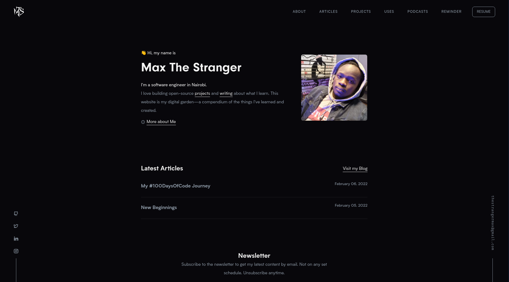

<div align="center">
  
</div>
<h1 align="center">
  code.maxthestranger.com - v2
</h1>
<p align="center">
  The 2nd iteration of <a href="https://code.maxthestranger.com" target="_blank">code.maxthestranger.com</a> built with <a href="https://www.gatsbyjs.org/" target="_blank">Gatsby</a> and hosted on <a href="https://www.vercel.com/" target="_blank">Vercel</a>
</p>
<p align="center">
  Previous iterations:
  <a href="https://github.com/maxthestranger/code.maxthestranger.com" target="_blank">v1</a>
</p>
<p align="center">
  <a href="https://code.maxthestranger.com/" target="_blank">
    
  </a>
</p>



## 🚨 Forking this repo (please read!)

Good artists copy, great artists steal. You can just clone and use this as a template for your site, just be sure to contribute if you have any ideas, and don't forget to say ~ Original Design by _Max The Stranger_ &nbsp; **yes, with attribution**.

### TL;DR

Yes, you can fork this repo. Please give me proper credit by linking back to [code.maxthestranger.com](https://code.maxthestranger.com). Thanks!

## 🛠 Installation & Set Up

1. Install and use the correct version of Node using [NVM](https://github.com/nvm-sh/nvm)

   ```sh
   nvm install
   ```

2. Install the Gatsby CLI

   ```sh
   npm install -g gatsby-cli
   ```

3. Clone the project

   ```sh
   git clone git@github.com:maxthestranger/code.maxthestranger.com_v2.git
   ```

4. Install dependencies

   ```sh
   npm install
   ```

5. Start the development server

   ```sh
   gatsby develop
   ```

## 🚀 Building and Running for Production

1. Deploy using vercel

   [](https://vercel.com/new/clone?repository-url=https://github.com/maxthestranger/code.maxthestranger.com_v2.git%2Fvercel%2Fnext.js%2Ftree%2Fcanary%2Fexamples%2Fhello-world)

:call_me_hand: See you in life buddy!
