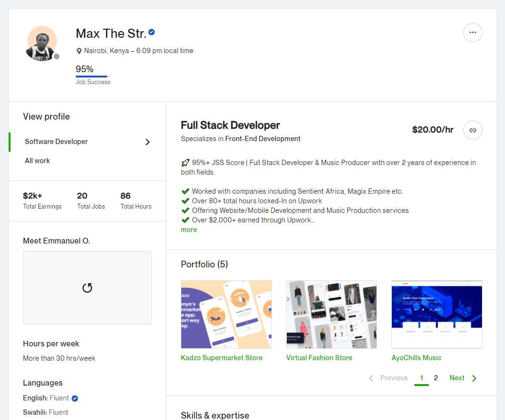
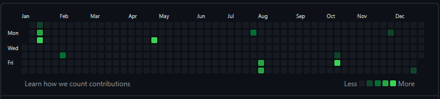
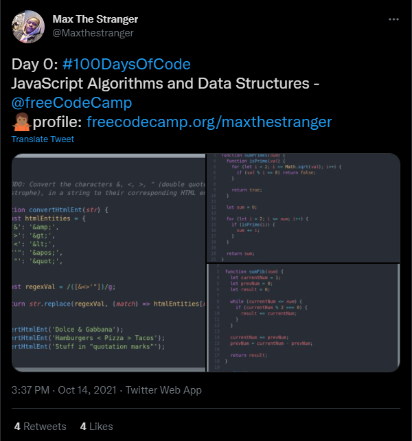
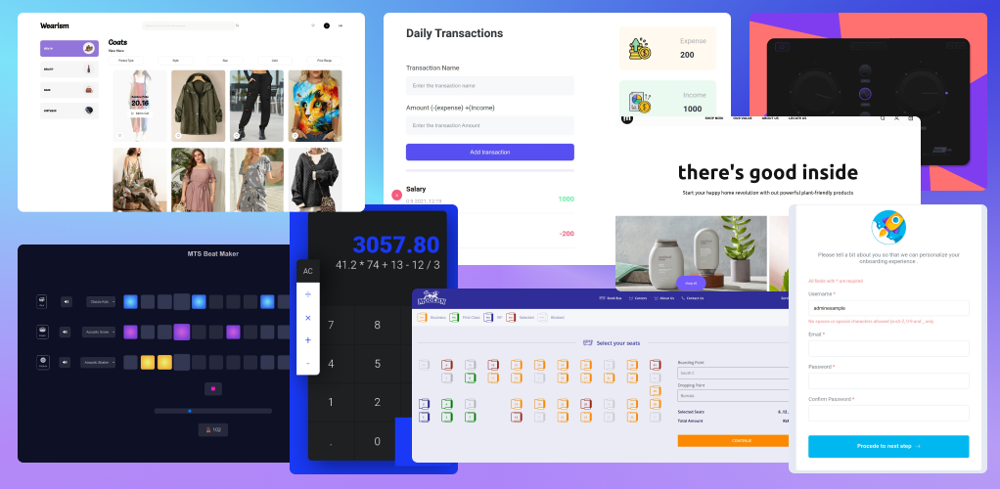
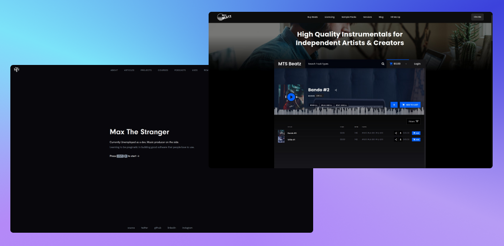
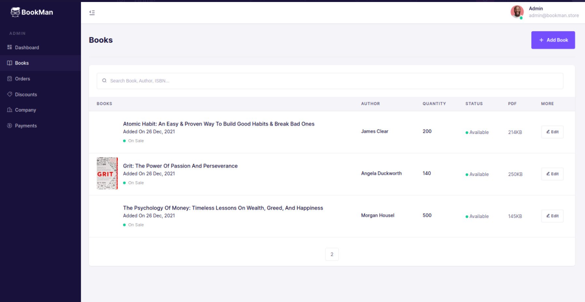
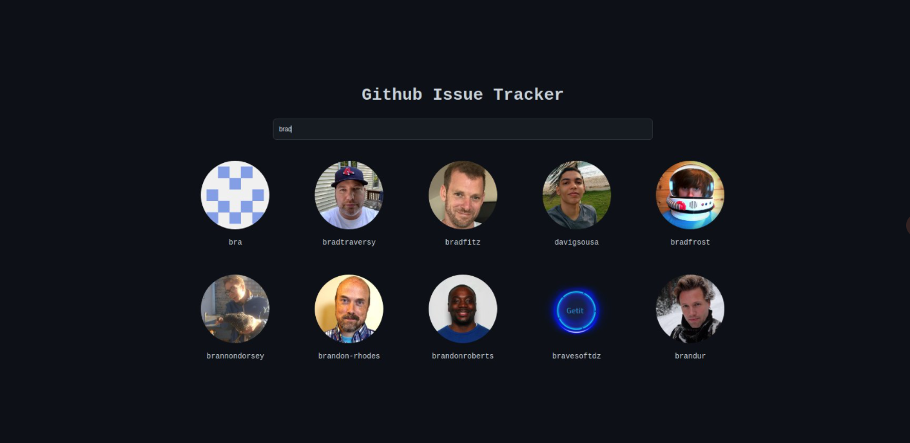
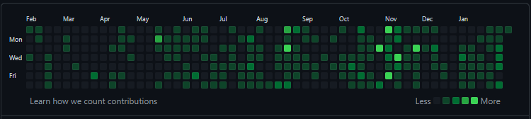

## Introduction

I first came across the concept of #100daysofcode via Twitter [@pokecoder](https://twitter.com/pokecoder). This was sometime late last year, around October when Ale the owner of the Twitter account wanted to learn front-end development. She was already a java developer at an automotive software company in Texas.

With this revelation, I decided to dig deeper into the topic and found out that, It was a phenomenon that already plagued the web, especially Twitter, with its origin stemming from a developer named [Alexander Kallaway](https://twitter.com/ka11away).

I was already somewhat a developer when I started this challenge, not employed, but as a freelancer at Upwork.

## The Why?

Being a freelance developer especially in python, you normally don’t get to work on full projects, it’s either a student wants his/her assignment done or someone wants some terminal applications that display random characters for a short film or someone's web app is down and they need a quick fix...

Not much experience when it comes to architecting and developing a useful application that can solve a real-life problem.
With this as a foundation to fuel the intention, I challenged myself to learn and apply a complete tech stack in 100 days. So I chose MERN stack, ‘cause why not, I mean one language front to back, sounds like a good ting' to me.

Github Contributions During Freelance Days

## The process

The rules of the challenge were simple in theory,

- Code for at least an hour every day, excluding tuts or courses, etc
- Push to Github and update the 100days challenge log every day
- Tweet about it and use the #100daysofcode
- Retweet, share, and comment on other people’s progress

Simple, right? I mean yes, they are, but as time progressed I decided to change the rules to fit my schedule which was already tight, I had to still pay the bills, so I decided to include learning time in my time log. Because when you are mostly learning, you normally tend to code along.

With that change, all was set.

I started on October 21st, 2021, logging it as Day 0, see what I did there?

_1. Javascript_

My main aim was to get through Javascript as it was the basic building block of the MERN stack, so I took the Javascript Algorithm and Data Structures course on [freecodecamp.org](https://www.freecodecamp.org/learn/javascript-algorithms-and-data-structures/) and went along with the challenges to a point where I was at least comfortable with writing javascript.

I also bought a book [Eloquent javascript](https://eloquentjavascript.net/) to complement the course and added javascript.info as a reference website.

I progressively learned as I went from challenge to challenge and from topic to topic.

In order to prove to myself that I could write javascript without even watching a video lesson on a project, I decided to build very common mini js applications which included:

[_Project Previews_](https://maxthestranger.github.io/30-projos-js-curve/)

_budget tracking app, form validation, beat maker, calculator, bus seat booking system, ecomerce web app_

The more projects I developed, the more I got comfortable writing and structuring the code.

I then decided to join [hackerrank](https://www.hackerrank.com/) to get comfortable with intermediate algorithm questions, which was for interviews.

I liked the way hackerrank sent me daily mails of algorithmic challenges — let’s call it a dose of algo a day

At this point the journey started becoming as automatic as an involuntary impulse, the first 10 to 20 days were difficult, not from coding but from developing this new habit, but as time went by, things become flawless.

_2. React.js_

From javascript, I refreshed my HTML and CSS skills which I already knew enough of to write some pretty mini-applications.

React came in as a second tool after js, on the MERN stack scale, this was surprisingly smooth and relieving, especially when you know the pain associated with querySelectors and innerHTML DOM concepts in Js.

I took the [code academy](https://www.codecademy.com/learn/react-101) react course which introduced me to class-based components with a bit of tension because classes in js are like a decorative concept to shell the somewhat complex idea of function prototypes.

Again, to prove to myself that I knew react.js, I made

[_Project Previews_](http://code.maxthestranger.com/)

- my coding portfolio, version 0,
- my music portfolio with a music player embedded from beatstars API, which was interesting to implement.

I then decided to jump on React libs, choosing next js, ‘cause why not? Popular and suited for data-intense applications which I was planning to work on next (no pun intended).
With next js on my belt, I developed the UI for the application

_3. Server Side_

As I got comfortable with js, react, and next js — It was that time again for some server-side of things.

With the eloquent js book touching on node js in the last chapters and a couple of youtube videos on the latter, I practiced in combination with express js framework to develop simple API with hardcoded JSON objects for models.

Then as I was nearing the 3/4 timeframe of the #100days challenge, I familiarised myself with Mongo DB and mongoose as the ODM, this enabled me to get rid of the hardcoded file-based models for storage and started integrating MONGO dB, via atlas to my simple API.

As proof or evidence of having the ability to now write a MERN application, I worked on the bookstore application, which boasted Next js and scss (no component or styling libs) on the frontend, node js via express, and mongo dB on the back end, I also used AWS S3 bucket to store the images after the file-based mutter module way proved to increase the application's size significantly.

I was planning to integrate MPESA payment platform but then an interesting fact came up as one of the owners of a bookstore on Twitter requested me if he could pay me to finish the application with flutter-wave payment gateway and integrate it to his front end app, which I was to develop too, I counter offered him and details on this on later articles

I continued developing more applications and experimenting with lots of other related technologies like tailwind CSS and even build a Github issue tracker using the Github API, which was fun, much fun that I started laughing every time I got an error because I knew it was just as a result of a silly mistake in my code — 4XX error on client 500 error on server

## Conclusion

One thing I have enjoyed, Is the process. I get happy every time I start and finish something.

I don’t want the feeling to stop, with James Clear’s book The Atomic habit, talking about how the system of achieving a goal is way more important than the goal itself, I learned that

- The secret to being good at anything is in the process, bits by bits with a well clear and concise curriculum on what comes after what — aligned to the goal
- Learning a tool is just a consequence that comes from wanting to accomplish something. Like building a web app results in you learning a language
- It's only hard in the beginning but gets easier as you go(habit)
- The best way to learn is by building, building small and ascending from that.
- Build-in public — tweet about it, share your stories and progress, you develop a sense of accountability when someone else comments or likes your progress every day. Thanks [@wangui](https://www.linkedin.com/in/wanguikamande/)
- Share and like other people’s progress — it's in the community's spirit
- Do not stop even after finishing the challenge
- Do not give up when you skip a day or 2 but be flexible enough to bounce back

Github Contributions Now

